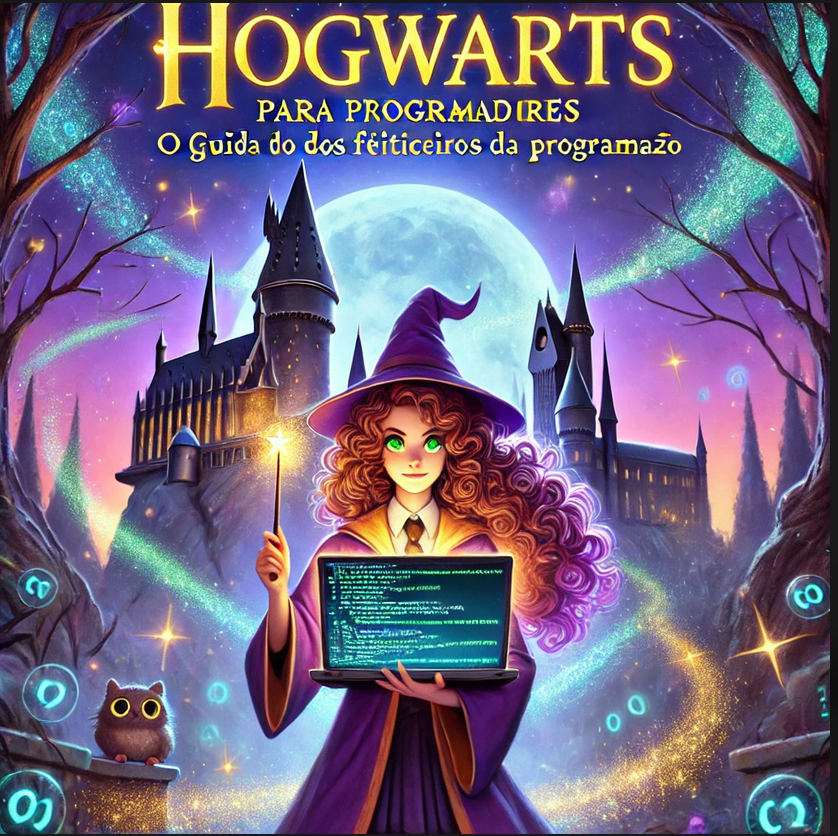

# Projeto EBOOK Gerado por I.A.s

 > ℹ️ **NOTE:** Este é o repositório desenvolvido para o Projeto "Criando um Ebook com ChatGPT & MidJourney"
- Imagem utilizada está em `assets` "Hogwarts-para-programadores.PNG"
- ebook gerado está em `output` "Ebook_Hogwarts-para-Programadores_Natalia.PDF"

Projeto com o objetivo de gerar um ebook digital com as facilidades das ferramentas de IA. todos os prompts
seguem abaixo.

## 💻 Tecnologias utilizadas no projeto

- [ChatGPT](https://chat.openai.com/) 
- [PowerPoint](https://www.microsoft.com/en/microsoft-365/powerpoint)

## 🧠 Prompts

ChatGPT：

|   Ação   | prompt                                                                                                                                                                                                                                                                         |
| :------: | ------------------------------------------------------------------------------------------------------------------------------------------------------------------------------------------------------------------------------------------------------------------------------ |
|  título  | Crie um título de um E-book sobre o tema Python, o ebook do nicho de programação e o subnicho é python. O título deve ser épico e curto e tenha uma temática mais nerd e com um toque de humor com Harry Potter, me liste 5 variações d                                                        |
| conteúdo | Faça um texto para ebook Hogwarts para Programadores: O Guia dos Feiticeiros da Programação, como foco em Python, listando os principais pontos com exemplos de código|

| Capa | Gere uma arte de capa com uma bruxa com cabelos cacheados e olhos verdes para esse título poderoso "Hogwarts para Programadores: O Guia dos Feiticeiros da Programação"|
------------------------------------------------------------------------------------------------------------------------------------------------------------------------------------------------------------------------------------------------------------------------------ |
## ✨ Features

- Conteúdo gerado via ChatGPT
- Imagens geradas via ChatGPT

## 📚 Materiais

- Imagens utilizadas em `assets`
- ebook gerado durante as aulas em `output`

## 🛠️ Instruções de execução

Utilizei os prompts acima nas ferramentas sugeridas para gerar o material base e utilize uma ferramenta de edição de documentos como power point, libreoffice , indesign para diagramação.

